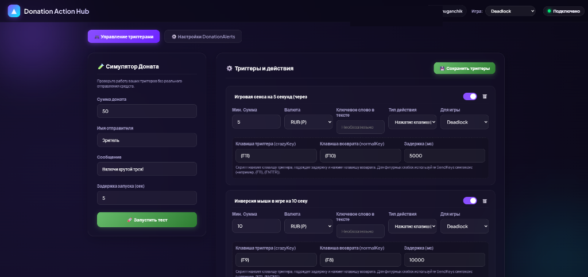

# DonationAlerts PC Actions



Мощный локальный сервер на Node.js, который позволяет управлять вашим ПК во время стрима за донаты через DonationAlerts. Когда зритель отправляет донат, программа может нажимать кнопки на клавиатуре, менять сенсу мыши, инвертировать мышь, запускать команды на ПК или открывать видео на YouTube.

## Что умеет программа:
* **Нажатие клавиш (`press_keys`)**: Нажатие любых клавиш при получении доната. Поддерживает сочетания клавиш (например, `{F7}disconnect{ENTER}`).
* **Бинды с задержкой (`press_binds`)**: Нажимает кнопку, ждет N секунд и нажимает кнопку возврата.
* **Инверсия мыши (`system_mouse_invert`)**: Настоящая системная инверсия курсора мыши на заданное время. 
* **Скорость мыши (`system_mouse_speed`)**: Системное изменение скорости мыши на определенное время.
* **Выполнение скриптов (`command`)**: Запуск любых локальных `.bat`, `.exe` или PowerShell скриптов (см. туториал ниже).
* **YouTube (`youtube`)**: Открывает конкретное видео на YouTube или ищет клип по запросу.

---

## 🛠 Установка (Сборка)

Если вы скачали готовый установщик (`DonationActionHub_Setup.exe`):
1. Просто запустите его и установите программу. Ярлык появится на рабочем столе.
*(У вас в системе должен быть предварительно установлен Node.js).*

Если вы качаете исходники:
1. Установите [Node.js](https://nodejs.org/ru).
2. Запустите `npm install` в папке с проектом.
3. Переименуйте `config.example.json` в `config.json` и запустите `run.bat`.

---

## 👨‍💻 Туториал: Как создавать свои скрипты для запуска

Вы можете заставить программу запускать любые ваши скрипты (например, менять обои, запускать звуки, выключать монитор и т.д.) при донате. 

### Шаг 1: Создание скрипта
1. В папке `commands` создайте текстовый файл и назовите его, например, `scary_sound.bat`.
2. Откройте его в блокноте и напишите код скрипта. Например, воспроизведение звука через PowerShell:
   ```bat
   @echo off
   powershell -c "(New-Object Media.SoundPlayer 'C:\path\to\scream.wav').PlaySync()"
   ```
3. Сохраните файл.

### Шаг 2: Добавление скрипта в Donation Actions
Чтобы этот скрипт запускался при донате (например, 100 рублей):
1. Откройте файл `config.json` (или добавьте через веб-интерфейс).
2. Добавьте новый экшен с типом `command`:
```json
{
  "id": "action-scary",
  "name": "Скример звук",
  "minAmount": 100,
  "currency": "RUB",
  "type": "command",
  "enabled": true,
  "game": "all",
  "command": "commands\\scary_sound.bat"
}
```
*Важно:* Поле `command` содержит относительный путь к вашему скрипту. Обязательно используйте двойные слеши `\\` в JSON!

Теперь при донате в 100 рублей запустится ваш `.bat` файл! Вы можете запускать так и `.exe`, и `.py`, и `.ps1` скрипты.

---

## Требования
* ОС: **Windows** (необходим для авто-компиляции C# скриптов и PowerShell команд).
* Node.js v16+
